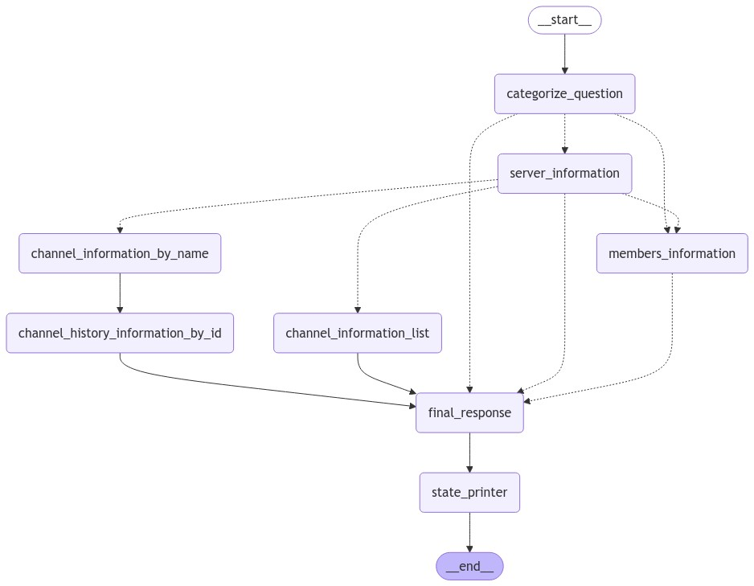

# MVP - Discord bot
This is a MVP discord bot with a few features like: checking people status, activities, channels, channels messages and general server information using a LLM. This is a project for me to study the tech.

# LangGraph
This is LangGraph version of the project. My older version using only LangChain is here [lang-chain-branch](https://github.com/rxgoa/EveProject/tree/lang-chain) branch.

# Diagram


You can generate the diagram running `create_graph_diagram.py` script.

# How to run
You will need:
- Discord API Key
- Groq API Key

then you'll need to create a venv, install deps and run:
```
python3 -m venv env
source env/bin/activate
pip3 install -r requirements.txt
python3 main.py
```


# LLM Wrapper (Groq+Langgraph+llama3)
This is a simple Discord bot using `Langchain`(and it's memory function) for keeping track of conversations, `LangGraph` to create our precise logic of what to do, `Groq` API integration for access to our models `llama3 70b`(LangGraph is using) and `llama3 8b`(our LangChain is using).

# Models
For the models I'm using two variantions. The most important one is `llama3 70b` that excel in understanding and a more complex context. The other one `llama3 8b` is for small talks like explaning what the user wants from it's input and also to apply prompt personality for our bot.

# Langchain Memory Retrieval
The memory retreivel for this project is simple and local (past 5 chats). Basically this function is very simple right now where, for example, if you ask Eve what the user is listening to and then you asked again (given the user changed the song), Eve will comment on that. She also can check the list of members of the server, channels and messages.

*Second Song*


Notice how she knows about the last song and comments on it. She is salty 😜

## Context aware
Eve also is context aware for filtering information. Because of the way we sent data to our LangGraph, we call filter data based in our input.

*Example*: `Eve, show me the last to messages in the channel neptune`


If you check our code, we don't have anything related to filtering. This is all our LLM doing the heaby lift for us.

# LangGraph
LangGraph is such a cool tool to use. For a project that is "heavy" in context, you want to be able to stir the boat of thinking from the bot, so you always know the LLM will obbey your intentions of logic. After implementing this same bot using only LangChain I can tell you LangGraph is the perfect tool to acomplish my goals for this small project.

# LangSmith
This is a tool for you to precise debug and see what your langchain and langgraph app is doing.


*First Song*


# system prompts
This project have 3 types of prompts (in a way):
1. A simple prompt where ask the model to understand what the user want, so that we can sent this new "input" to our Tool calling model. [Prompt](/llm/prompt_creation.py)
2. The most "complex" prompt of the project. This prompt basically will try to: understand what the user want, think about it, and return the necessary nodes to be called. It will return a list of nodes that the prompt deemed necessary to achieve what the user wants. [Prompt](/prompts/prompts.py)
3. This prompt is the final result you see when using. Basically we send the data(the information that you wanted) and apply a prompt of personality from `Eve`. [Prompt](/llm/prompt_creation.py)

